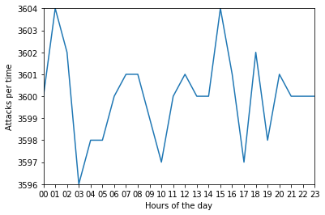
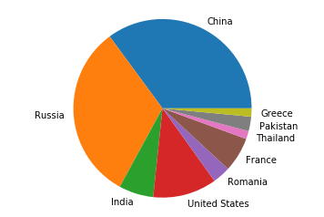

# serres-hackathon-2019

Participants: Nousi Christina (crtnousi), Olympia Xenidou (olympiaxen), Prodromos Sarakinou (prosa), Angelousis Sotirios (angelsotiris) 
Problem: https://github.com/serrestech/hackathon/tree/topic 
<b>Results<b> 

TASK 1 
Count Of Traffic : 86400 
TASK 2 
Count of 5xx Error's Responses : 4585 
TASK 3 
Count of different IPs : 20 
TASK 4 
Attacks Percentage: 0.679525462962963 
TASK 5 
SQL Injections: 5845 
XSS Attacks: 7696 
Local File Inclusion attacks: 9478 
Undefined attacks: 35692 

TASK 7 
Country with most Attacks: China 
TASK  
Hour with most Attacks: 20:00 
 
 

TASK 9 

 
 
TASK 10 
 
 
 
BONUS TASK 
Most Dangerous IP: 62.109.16.162 

